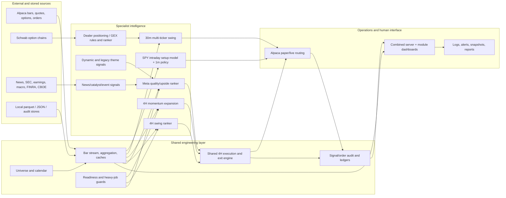
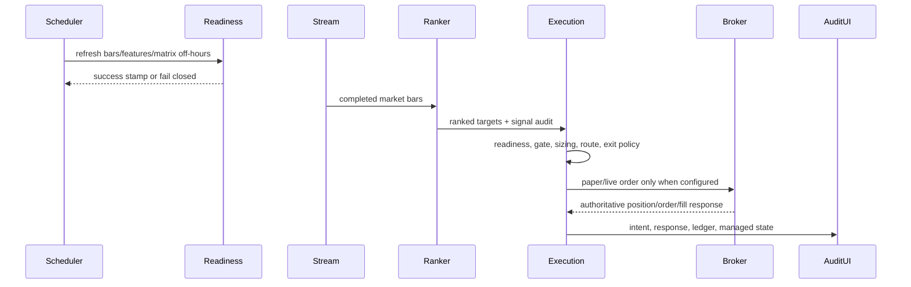

# Capstone Research Dossier

Status: evidence-gathering dossier, not the final capstone paper. Repository state audited on 2026-07-15 at `ec6bfc963732d049d9e379e89bbfc4d42cf15e31` on branch `capstone-repro-audit`. The worktree already contained unrelated user changes; none were modified.

## Executive project overview

CynolycusBot is an applied AI and software-engineering project that evolved from a narrow SPY prediction/trading prototype into a multi-strategy, real-time market analysis and execution workspace. Its current architectural center is no longer one monolithic model. It is a set of specialist signal generators—30-minute swing, 4-hour momentum expansion, 4-hour swing, meta-ranking, catalyst/news, themes, and dealer positioning—connected to shared data, audit, readiness, execution, and dashboard infrastructure.

The strongest capstone story is iterative engineering under adversarial time-series conditions: causal feature construction, changing labels and models after negative results, separation of signal quality from execution quality, transition from test-selected backtests to validation-selected/frozen-test and embargoed walk-forward evaluation, and operational hardening after paper-trading and memory/recovery failures. The repository does **not** establish sustained live profitability or production readiness. It establishes substantial engineering breadth, several defensible out-of-sample ranking results, paper/live-data operation, broker integration, and unusually candid evidence of failures and corrections.

## Problem definition and constraints

The practical problem is to identify actionable equity momentum/expansion opportunities and convert them into controlled, auditable trading decisions without constant discretionary monitoring. Constraints found in the implementation include:

- non-stationary, noisy, imbalanced financial time series;
- exact event/observation/signal/order/fill-time alignment;
- lookahead, model-selection, survivorship, and static-metadata bias;
- inconsistent market-data availability, API limits, missing bars, and stale caches;
- realistic option spreads, decay, expirations, partial/rejected orders, and position reconciliation;
- one free-tier Alpaca stream shared across a broad universe;
- memory pressure from full-universe pandas jobs under WSL;
- separation of research, paper, and live credentials/routing;
- explainability and auditability of model-to-order decisions.

## Repository inventory and evidence coverage

The audited tree contains 61,348 non-`.git`/non-`.venv` files and is about 64 GB locally, dominated by data and experimental artifacts. Git tracks 5,511 files across 453 commits dated 2025-11-25 through 2026-07-15. There are 707 Python/shell/PowerShell source files and 62 `test_*.py` files. Major storage areas at audit time were `strategies/` 48 GB, `signals/` 9.3 GB, `Data/` 5.7 GB, `UI/` 307 MB, `themes/` 111 MB, and `research/` 110 MB. The code inventory includes approximately 270 Python files under `strategies`, 126 under `signals`, 66 under `themes`, 45 under `core`, and 25 under `UI`.

Evidence inspected included root documentation, `LIVING_SUMMARY.md`, Git history, current model manifests, feature/label/training/live code, backtest outputs, paper/live ledgers, July reproducibility artifacts, the confluence null-result study, test configuration, scheduling and launcher scripts, dashboards, shared execution code, and repository cleanup/security notes. Generated summaries were used as navigation, not automatic proof. Primary artifacts and executable regression tests were preferred.

## Evidence-backed project evolution

1. **Broker/data bootstrap (Nov 2025).** Initial commit `8a26d82`; Schwab authentication in `9ab2cf3` and migration to `schwab-py` in `fe66d5c`.
2. **Daily ML prototypes and first leakage correction (Dec 2025).** MABiLSTM, GA-XGBoost, broad technical indicators, preprocessing/labels; explicit leakage removal in `47d9132` and `5c374d1`.
3. **Intraday and multi-timeframe SPY research (Jan 2026).** Pivot/continuation labels, support/resistance, regular-hours correction (`93b63df`), GA-XGBoost, BiLSTM, iTransformer, TCN, and quantile/sequence experiments.
4. **RL execution experiment (Jan–Feb).** PPO environment/policy (`0ca20a2`) underwent repeated reward, action, split, and artifact changes; it survives as historical research, not the main entry path.
5. **End-to-end SPY operation (Feb–Mar).** Alpaca WebSocket (`3cab745`), live/replay runners, options plumbing, order guardrails (`ec7b0d3`), UI (`cbd5c5e`), and 1-minute execution (`2528b32`).
6. **Setup-model plus deterministic confirmation redesign (Mar–Apr).** Fuzzy swing-support labels (`4fc800a`) and selected trigger policy (`a917f33`) produced the durable 10-minute GA-XGBoost setup / 1-minute rule-confirmation architecture.
7. **Cross-sectional expansion (Apr–May).** Multi-ticker swing began in `2088503`; broader swing model in `27baf7e`; momentum expansion in `f2bfd3c`. This shifted the center of gravity away from SPY-only prediction.
8. **Multi-model platform (May).** Themes (`821f193`), news/events/forward-guidance/meta scaffolding (`2364756`), SEC/earnings enrichment (`3038f34`), live news scoring (`4073699`), and social attention (`6217f9c`).
9. **Execution and data-quality lessons (May–Jun).** Paper-option forensics separated directional selection from spreads, decay, restored-state damage, and exit reliability. Theme shorts and top-three rotation failed in important regimes. Catalyst horizons and corpus coverage were found misleading/incomplete and redesigned.
10. **Dynamic data/taxonomy and repository reorganization (Jun).** CBOE, FINRA and profiles (`73a2344`); dynamic theme pipeline (`712c540`); `core/signals/themes/strategies` reorganization (`8dbd648`).
11. **Integrated live/paper hub (Jun–Jul).** Shared WebSocket dashboards, dealer positioning, scheduled 4-hour loops, readiness jobs, and HTF live runner. A July WSL memory failure motivated job guards and supervised restart.
12. **Scientific correction and shared execution (Jul).** Leakage/reproducibility audit (`b9579fe`), results lock (`8b75062`, `208e2ee`), raw-bar loader fix (`3815e1b`), val-select/test-freeze backtests (`018566b`), one-shot 4H study (`f879d01`), then shared readiness/audit/execution (`bac3f9b`) and migration of momentum/HTF/meta (`729273b`, `c6cffe3`, `cc3c395`).

See [CAPSTONE_TIMELINE.md](CAPSTONE_TIMELINE.md) for the detailed evidence chain.

## Current architecture



### Concise live-operation flow



### Engineering boundaries

- **Research/backtesting:** feature, label, training, OOF, sweep and analysis code under `strategies/*`, `signals/*`, `backtests/`, and `scripts/` writes versioned/local artifacts.
- **Live inference:** specialist runners load saved boosters and current caches; the 30-minute swing live feature builder reuses the offline feature builder.
- **Execution:** SPY and swing retain strategy-specific routing; momentum, HTF, and meta use `core/live_4h_exec.py` with injected ranking/routing functions.
- **Operations:** `UI/combined_server.py` shares one stream, schedules subprocesses, and exposes module dashboards. `scripts/run_live_server.sh` adds restart/backoff, watchdog, allocator controls, and crash logging.
- **Data jobs:** `scripts/nightly_market_data.sh` and `scripts/nightly_data_readiness.sh` orchestrate external collection and feature/matrix refresh. `core/live_job_guard.py` prevents overlapping heavy jobs and blocks fragile live windows under low memory.
- **Persistence/recovery:** parquet/CSV/JSON/JSONL stores, readiness stamps, broker-authoritative reconciliation, managed-position ledgers, audit logs, and exit fallbacks. There is no central transactional database in the inspected current architecture.

## Module inventory and maturity

| Module | Role | Current maturity | Evidence-backed qualification |
|---|---|---|---|
| SPY intraday | 10m setup prediction + 1m confirmation | Legacy/operable baseline | End-to-end live/replay plumbing; live directional result described as near noise. |
| Multi-ticker swing | 30m multiclass swing-zone model + 5m execution | Research-ready; paper/live capable | 14.8M-row training artifact; clean frozen test exists; paper options expose execution weakness. |
| Momentum expansion | 4H cross-sectional continuation ranker | Strongest research candidate; shared live runner | Clean OOF lift and frozen policy results; model winner originally selected on test. |
| HTF swing | 4H cross-sectional swing ranker | Research/live capable with caution | Strong top-K OOF/frozen results; weak global Spearman and historical final-export fragility. |
| Meta ranker | Combines technical/theme/news/event/context signals | Experimental-operational | Upside ranker materially stronger than quality ranker; shared live execution; calibration imperfect. |
| News/catalyst | Collection, dedup, embeddings, tone, trajectory/similarity signals | Research/live feature feed | Useful meta features; corpus/horizon/history and current test-isolation issues limit standalone claims. |
| Scheduled events / forward guidance | Earnings/macro/SEC context | Read-only/research | Implemented ingestion/features/backtests; not an established standalone edge. |
| Dynamic themes | BGE aggregation, HDBSCAN, LLM naming/relationships, soft memberships | Experimental feature pipeline | LLM is used for taxonomy, not trade decisions; taxonomy/history caveats remain. |
| Legacy themes | Rule rotation and static taxonomy | Legacy but still a live dependency | Supplies current mapping/universe files; standalone ML result was marginal. |
| Social attention | Reddit collection, sentiment, embeddings, clustering | MVP/partially populated | Code and tests exist; confluence study reports no usable collected history. |
| Dealer positioning/ranker | Schwab-chain GEX levels and rule/rank-based option selection | New experimental paper/live-capable module | Short history prevents defensible backtest claims; live routing separately gated. |
| UI/operations | Shared stream, dashboards, scheduler, readiness/recovery | Integrated operational layer | Multiple ports/pages, process supervision, audits; WSL reliability remains a risk. |

## Data and quantitative methodology

### Data acquisition and alignment

Alpaca supplies intraday/daily bars, quotes, option data and order interfaces; Schwab supplies option chains for dealer positioning. News/event sources include SEC filings, earnings and economic calendars, Yahoo/yfinance-derived data, FINRA short volume, CBOE options snapshots, and USAspending mappings. The system uses UTC-aware timestamps plus US/Eastern market calendars and session filtering. Causal patterns include previous-day daily context, as-of joins, backward rolling/EWM features, and incomplete-forward-window label removal.

Important gaps: current curated universes are applied historically, present-day sector/cap metadata can leak future success, some calendar/taxonomy/scorer versions are retroactive, and several model split boundaries lack purge/embargo. Raw and processed data are separated by convention, but the artifact-heavy repository has historically tracked generated data and is not fully reproducible from a clean clone without local caches.

### Major learned and rule-based methods

- **GA-XGBoost SPY and swing models:** tree ensembles address nonlinear tabular interactions; genetic selection reduced high-dimensional SPY inputs. The project found that GA selection did not automatically beat all-feature baselines.
- **Sequence and reinforcement-learning experiments:** MABiLSTM, iTransformer, TCN and PPO explored temporal representation and execution control. They were superseded because added complexity did not yield the strongest robust operational path.
- **Cross-sectional 4H rankers:** XGBoost/LightGBM classifier and ranker families across seeds were compared using NDCG@K, precision@K, Spearman and forward returns. Rank usage is more defensible than probability calibration.
- **Meta ranking:** specialist OOF scores plus theme, liquidity, regime, news, macro, Treasury and guidance features feed quality/upside models. The upside model is materially stronger than the quality model.
- **NLP/IR:** BGE embeddings, FinBERT tone, similarity search, clustering, source-quality and buzz features organize noisy news. OOF news predictions were later introduced after a large in-sample/OOF gap exposed leakage risk.
- **Dynamic theme discovery:** article/profile embeddings, HDBSCAN, LLM-assisted naming/hierarchy/relationships, soft memberships, and time-varying meta features. The LLM does not select trades.
- **Rule systems:** 1-minute price confirmation, ATR stops/targets, option spread/expiry gates, dealer gamma walls/magnets, readiness gates, routing, and broker reconciliation complement learned scores.

### Targets and evaluation

Targets include pivot/swing support zones, triple-barrier outcomes, future maximum/close return, drawdown, alpha, trend persistence, survival scores, and meta quality/upside. Class imbalance is handled through sample weights, neutral downweighting, soft labels, or ranking metrics rather than accuracy alone.

Evidence quality tiers used in this dossier:

1. **Strongest:** 21-day-embargoed walk-forward OOF and validation-selected/frozen-test artifacts with reproducible provenance.
2. **Moderate:** fixed test reports where model family/seed was selected by that test; useful with explicit winner's-curse caveat.
3. **Weak:** same-split parameter sweeps, stale artifacts, or backtests without portfolio concurrency/sizing.
4. **Anecdotal:** short paper/live sessions and operational observations.

## Consolidated strongest results

- Multi-ticker swing classifier: frozen-test accuracy 61.60% across 2,224,877 recomputed rows; long/short class precision about 41.24%/41.10%. The clean execution sweep had 4,096 trades, 48.68% PnL win rate, PF 1.361 and mean PnL 0.4509% under its fixed-notional convention.
- Momentum OOF top-10: mean fixed-horizon close return 6.69% versus 1.37% for non-top-10 rows (`n=29,335` top rows), with overlapping windows. Clean frozen policy: 3,876 trades, 74.74% win rate, PF 1.53, fixed-notional total-return convention 92.52%, max drawdown -15.30%.
- HTF OOF top-10: mean fixed-horizon close return 8.94% versus 1.97% for non-top-10 rows (`n=23,464`), while global score/target Spearman is approximately zero. Clean frozen baseline policy: 23,173 trades, 38.99% win rate and PF 1.487.
- Meta-upside OOF top-10: 9.33% mean forward close return versus 1.78% universe, `n=11,575`; OOF Spearman 0.202. Meta-quality OOF global Spearman is -0.005 and should not be advertised as a calibrated predictor.
- OOF meta exit comparison: immediate rank-dropout mean 0.57% (`n=3,327`) versus fixed +20% target mean 5.87% (`n=1,259`) and 50%-at-20% scale-out/horizon mean 4.96% (`n=1,430`) on the same signal substrate.
- Negative paper result: 123 closed option positions across two sessions lost $6,246.50 with 34.15% win rate, despite 18 fresh calls averaging +36.19% option return and +1.40% underlying return. This supports a selection-versus-execution lesson, not a profitability claim.
- Confluence discovery: 524 pairs, best FDR q=0.56, zero certified interactions; power floor about +7–10 percentage points. The correct conclusion is a bounded null result.

Headline backtest “total return” and drawdown values are **not account-level compounded returns**. They use fixed $1,000 notional per signal, $100,000 display base, exit-time booking, and unconstrained concurrency. Costs are absent from some headlines; 20–30 bp sensitivity columns exist for selected studies. These results demonstrate signal/policy behavior, not deployable portfolio CAGR.

## Testing and validation performed in this audit

Commands and results:

```text
PYTHONPATH=. .venv/bin/python -m pytest -m 'not slow and not network and not live' scripts/capstone/tests core/tests/test_live_readiness.py core/tests/test_live_4h_exec_ledger.py core/tests/test_exit_policy.py core/tests/test_pending_open_deferral.py
Result: 31 passed, 2 failed, 4 deselected.

PYTHONPATH=. .venv/bin/python scripts/run_safe_smoke_tests.py -q
Result: 110 passed, 2 failed, 3 warnings.
```

Capstone failures: the locked SPY daily artifact changed from 1,496 to 1,498 rows, causing its fingerprint and 12/25-day reference means to drift slightly (0.7176%→0.7195%; 1.4686%→1.4672%). Other selected non-slow capstone result regressions passed. Smoke failures: catalyst fixture calls unexpectedly included 550 default `earnings_result` records, breaking empty-input and exact-kind expectations. No production code or lock was modified.

Slow tests that join the 15M-row swing probabilities to a 7.7GB matrix, model retraining, external collection, broker-connected tests, and live-order paths were deliberately not run.

## Failures, redesigns, and lessons learned

- Leakage was discovered and corrected repeatedly, beginning in Dec 2025 and later in news OOF scoring and meta-confluence feature screening.
- Exact-pivot and triple-barrier SPY targets did not generalize well; fuzzy setup zones plus deterministic confirmation were more operationally useful.
- Deep learning and PPO increased complexity without becoming the strongest validated path.
- Same-split policy tuning materially exaggerated results. Validation-selection/frozen-test reduced swing combined win rate from a stale 61.3% artifact to 48.7%, momentum ret/DD about 7.4×, and HTF about 2.3×.
- A swing raw-bar loader silently skipped most tickers after timestamp moved from column to index; this changed trade counts and motivated loader regression tests.
- Theme top-three/weak-theme-short hypotheses failed in rebound regimes; bottom ranks often represented quiet or rebound-prone names, not shorts.
- News labels and corpus composition were initially misleading; source coverage, body extraction, horizon naming, and OOF prediction required redesign.
- Paper options showed that correct underlying direction can still lose through spread, decay, expiry, stale/restored state, and exit failures.
- Shared-stream backlog and WSL OOM events showed that an accurate model is insufficient without scheduling, memory budgets, recovery, and audit.
- Confluence mining correctly ended in a null result rather than promoting multiple-testing noise.

## Current live-system capability: precise claims

Supported: live market-data streaming; scheduled/live inference; paper and separately gated live Alpaca order-generation paths; Schwab chain reads; broker reconciliation; option/equity routing; shared dashboards; audit ledgers; readiness checks; supervised restart; and some evidence of orders actually submitted in paper and real-account contexts recorded in operational summaries.

Not supported by adequate evidence: sustained realized live profitability, production-grade reliability, a fully causal/survivorship-free portfolio backtest, stable option execution across regimes, statistically sufficient dealer/social histories, or unattended safety under all failure modes. The dossier therefore uses “live-data operation,” “live inference,” “broker-integrated,” and “paper/live-capable,” not “profitable” or “production ready.”

## Software and systems engineering contribution

Graduate-level engineering evidence includes reusable feature pipelines, shared live/offline feature construction, modular specialist models, dependency injection in shared execution, structured configs/manifests, time-aware joins, OOF artifact handoffs, regression-locked metrics, unit/smoke/backtest layers, WebSocket fanout, HTTP dashboards, scheduling/subprocess isolation, state reconciliation, fail-closed readiness, memory/single-flight guards, logging/alerts, and post-incident recovery design.

Limitations include no pinned transitive environment lock, no container/deployment manifest found, no central experiment tracker, mutable local data behind some locks, large untracked/locally required artifacts, and incomplete isolation in catalyst tests.

## Security and responsible operation

Credentials are expected in `.env` profiles and live flags are separate. Dealer Ranker live routing is separately enabled; paper is the safer default. Current token files were removed/ignored, but `docs/REPO_CLEANUP.md` records that Schwab OAuth tokens existed in Git history. Local evidence does not prove rotation or history purge, so this remains a serious security/reporting risk. The dossier does not reproduce credentials or account identifiers.

## Limitations and risks

- test-selected model-family winners across 20 candidates;
- no purge at several train/validation/test boundaries (OOF uses a 21-day embargo);
- 2026-curated universe and current metadata applied retrospectively;
- full-sample near-duplicate correlation removal in at least one 4H pipeline;
- overlapping forward-return windows and cross-sectional dependence;
- incomplete transaction-cost, liquidity, fill, concurrency and capital constraints;
- mutable benchmark artifact and stale/missing historical trade artifacts;
- calibration weaknesses and regime dependence;
- short paper/live samples and limited dealer/CBOE/social history;
- current catalyst test isolation defect;
- operational memory/backlog/recovery risk;
- no proof that historical credentials were fully remediated.

## Recommended roadmap-aligned future work

1. Freeze immutable dated benchmark/data snapshots and restore a fully green capstone lock.
2. Add purged/embargoed model selection, time-varying universe membership, and point-in-time fundamentals/metadata.
3. Build a portfolio-level simulator with concurrency, buying power, sizing, slippage, option spreads/decay and benchmark-equivalent exposure.
4. Shadow-paper the frozen momentum and long-only HTF policies for 4–6 weeks before any deployment claim.
5. Fix catalyst input isolation and add point-in-time fixture tests for all signal builders.
6. Accumulate 6–9+ months of dealer/CBOE history and at least six new labeled months before re-testing confluence.
7. Formalize environment locking, data/model manifests, and incident/runbook documentation.
8. Verify credential rotation/history purge and document the security boundary without exposing secrets.

## MEng AI program connections

- **Machine learning:** tree ensembles, feature selection, sequence models, RL experiments, class weighting, calibration and ranking.
- **AI/NLP/IR:** embeddings, semantic similarity, FinBERT, clustering, LLM-assisted taxonomy and structured feature generation.
- **Time-series/statistical evaluation:** causal alignment, walk-forward OOF, embargo, regime analysis, multiple-testing/FDR and power analysis.
- **Optimization/experimental design:** GA feature selection, family/seed competitions, policy grids, ablation, frozen-test corrections and negative-result preservation.
- **Data engineering:** heterogeneous ingestion, normalization, as-of joins, cached multi-timeframe pipelines and immutable/artifact provenance goals.
- **Software engineering:** modular architecture, shared execution, testing, configuration, separation of concerns and recovery mechanisms.
- **Real-time/distributed systems:** WebSockets, fanout queues, subprocess scheduling, readiness stamps, single-flight/memory guards and watchdogs.
- **Human-facing AI:** dashboards, plots, signal/order audits, calibration views and responsible interpretation of model ranks.

Course-specific claims require author confirmation; see [CAPSTONE_QUESTIONS_FOR_AUTHOR.md](CAPSTONE_QUESTIONS_FOR_AUTHOR.md).

## Candidate figures and tables

- System architecture and live-operation diagrams above.
- Existing 12-figure locked set in `research/capstone/figures/`, especially selection-bias correction, OOF lift, calibration, exit policy and paper sessions.
- Timeline of hypothesis → failure → redesign → integration.
- Module maturity table and evidence-quality ladder.
- Clean versus biased results table.
- Data-source / availability-time / use matrix.
- Research-paper table separating frozen-test, OOF, paper, live-data and live-order evidence.

## Candidate bibliography topics

Use primary literature later for: financial time-series leakage and purged cross-validation; backtest overfitting and probability of backtest overfitting; gradient-boosted trees; genetic feature selection; learning-to-rank/NDCG; calibration; triple-barrier/event labeling; transaction-cost and market-impact modeling; option microstructure/decay; FinBERT and financial embeddings; HDBSCAN; retrieval/semantic similarity; concept drift; multiple-testing/FDR; human-centered explainability; and resilient event-driven trading architectures.

## Strongest defensible capstone contributions

1. An end-to-end evolution from a single-asset prototype into a modular AI-assisted market platform with data, models, execution, monitoring and recovery.
2. A reusable cross-sectional 4H ranking stack with meaningful embargoed OOF top-K separation, especially momentum and meta-upside.
3. A rigorous self-audit that quantified and corrected selection bias, locked provenance, and converted impressive but weak claims into defensible frozen-test claims.
4. Engineering separation of specialist scoring from shared execution, broker reconciliation, readiness and audit.
5. Honest negative findings—SPY live weakness, paper option losses, theme/catalyst failures, and a statistically calibrated confluence null result—that directly changed design.

## Open author input

The most material unknowns are the exact program/course mappings, the author's personal design motivations and role, whether any real-money results may be discussed, credential-remediation status, intended capstone scope (SPY evolution versus current platform), and acceptable disclosure of financial/operational details. The focused questions are in [CAPSTONE_QUESTIONS_FOR_AUTHOR.md](CAPSTONE_QUESTIONS_FOR_AUTHOR.md).
